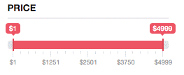

instantsearch-ion.rangeSlider
=================

This JavaScript library embeds the awesome [ion.rangeSlider](https://github.com/IonDen/ion.rangeSlider) as an [instantsearch.js](https://github.com/algolia/instantsearch.js) widget.

[](http://travis-ci.org/algolia/instantsearch-ion.rangeSlider)
[](http://badge.fury.io/js/instantsearch-ion.rangeslider)

Table of Contents
-----------------

* [Preview](#preview)
* [Usage](#usage)
* [Development](#development)
* [Testing](#testing)
* [Credits](#credits)


Preview
------



Usage
------

To use the `ion.rangeSlider` as a widget, do as follow:

 * include the `ion.rangeSlider` theme, for instance the `ion.rangeSlider.css` and `ion.rangeSlider.skinFlat.css` stylesheets,
 * include the `ion.rangeSlider.min.js` JavaScript script,
 * include the `instantsearch-ion.rangeSlider.min.js` JavaScript script,
 * and instantiate the `instantsearch.widgets.ionRangeSlider` widget.


**Note:** If you don't specify the min/max values; you need to ensure your `attributeName` option is targeting a **faceted** attribute.

```html
<!DOCTYPE html>
<html>
  <head>
    <link rel="stylesheet" type="text/css" href="https://cdn.jsdelivr.net/ion.rangeslider/2.0.6/css/ion.rangeSlider.css">
    <link rel="stylesheet" type="text/css" href="https://cdn.jsdelivr.net/ion.rangeslider/2.0.6/css/ion.rangeSlider.skinFlat.css">
  </head>
  <body>
    <div id="slider"></div>
    <!-- [...] -->
    <script src="https://cdn.jsdelivr.net/ion.rangeslider/2.0.6/js/ion.rangeSlider.min.js"></script>
    <script src="instantsearch-ion.rangeSlider.min.js"></script>
    <script>
      var search = instantsearch({
        appId: 'YourApplicationID',
        apiKey: 'YourSearchOnlyAPIKey',
        indexName: 'YourIndexName'
      });
      // [...]
      search.addWidget(
        instantsearch.widgets.ionRangeSlider({
          container: '#slider',
          attributeName: 'YourAttribute',
          // if you want to specify 2 different attributes, use:
          //
          // attributeName: {
          //  lowerBound: 'YourLowerBoundAttribute',
          //  upperBound: 'YourLowerBoundAttribute'
          //},

          //
          // if you want to force the min/max values, use:
          // min: 0,
          // max: 100,

          //
          // if you want to pass extra parameters to the underlying
          // ionRangeSlider, you can use the following object:
          // ionRangeSliderOptions: {
          //   prettify_enabled: false
          //}
        })
      );
      // [...]
      search.start();
    </script>
  </body>
</html>
```

Development
------

To start developing, you can use the following commands:

```sh
$ npm install
$ npm run dev
$ open http://localhost:8888/test/playground.html
```

Linting is done with [eslint](http://eslint.org/) and [Algolia's configuration](https://github.com/algolia/eslint-config-algolia) and can be run with:

```sh
$ npm run lint
```

Testing
------

Unit tests are written using [Jasmine](http://jasmine.github.io/) and ran with [Karma](http://karma-runner.github.io/). Integration tests are using [Mocha](http://mochajs.org/) and [Saucelabs](https://saucelabs.com/).

To run the unit tests suite run:

```sh
$ npm test
```

To run the integration tests suite run:

```sh
$ npm run build
$ npm run server
$ ngrok 8888
$ TEST_HOST=http://YOUR_NGROK_ID.ngrok.com SAUCE_ACCESS_KEY=YOUR_KEY SAUCE_USERNAME=YOUR_USERNAME./node_modules/mocha/bin/mocha --harmony -R spec ./test/integration/test.js
```

Credits
------

 * **Ion.RangeSlider**. An easy, flexible and responsive range slider with tons of options.
